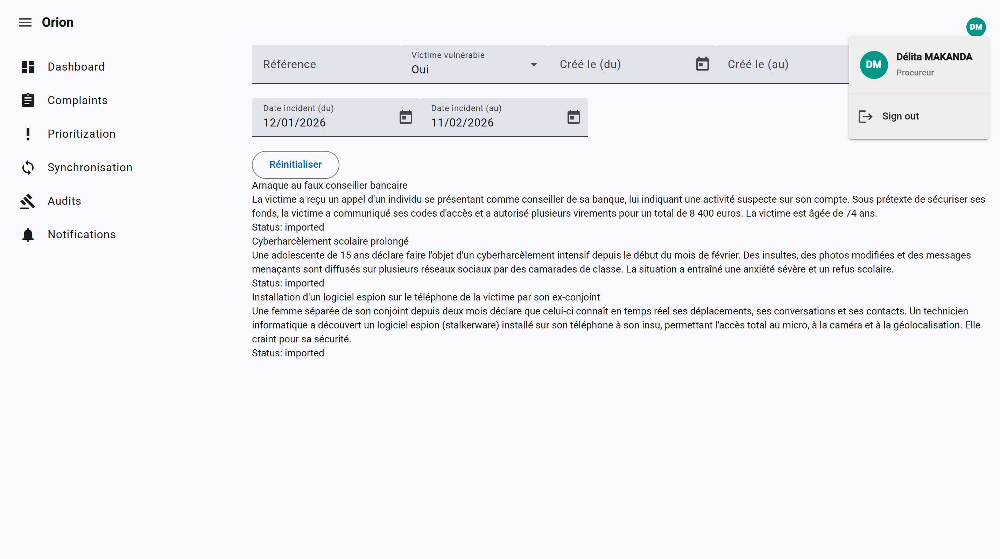

# Orion

Orion est une plateforme d'aide à la priorisation et à l'analyse des plaintes destinée aux administrations, magistrats et procureurs.

L'objectif du projet est de démontrer comment l'ia peut assister les agents du ministère de la justice dans le traitement des dossiers tout en conservant une validation humaine à chaque étape de la plainte.


## Screenshot




## Architecture

```text
orion-platform/
├── mock-system-api/
├── orion-api/
└── orion-web/
```

### mock-system-api

Mock d'un système externe de gestion des plaintes.

Technologies :

* json-server

Responsabilités :

* Fournir les plaintes agrégées
* Permettre les tests d'intégration

### orion-api

[](https://github.com/delitamakanda/orion-platform/actions/workflows/django.yml)

Backend principal de la plateforme.

Technologies :

* Django
* Django REST Framework
* SQLITE

Responsabilités :

* Synchronisation des plaintes
* Analyse IA
* Gestion des utilisateurs
* Logs

### orion-web

[](https://github.com/delitamakanda/orion-platform/actions/workflows/ci-angular.js.yml)

Interface utilisateur.

Technologies :

* Angular 22
* Resource API
* Signal Forms
* Angular Material
* Tailwind CSS

Responsabilités :

* Consultation des plaintes
* Visualisation des priorités
* KPI


## Fonctionnalités

### Gestion des plaintes

* Import automatisé
* Consultation
* Recherche et filtrage

### Priorisation (IA)

* Score de priorité
* Criticité
* Recommandations
* Résumé automatique

### Reporting

* Tableaux de bord (KPI, Exports CSV, Excel...)

## Scripts de lancement

### Démarrage complet (API + Web + Mock)

```bash
./scripts/start-dev.sh
```

Sous Windows (PowerShell):

```powershell
.\scripts\start-dev.ps1
```

### Démarrage manuel par service

orion-api:

```bash
python manage.py runserver
```

sync all complaints:

```bash
python manage.py sync_job
```

orion-web + mock-system-api:

```bash
npm run start:all
```

## Docker Compose

Démarrage complet avec Docker Compose (mock-system-api + orion-api + orion-web):

```bash
docker compose up --build
```

Services exposés:

* `mock-system-api`: http://localhost:3001/api/v1
* `orion-api`: http://localhost:8000/api/v1
* `orion-web`: http://localhost:4200
